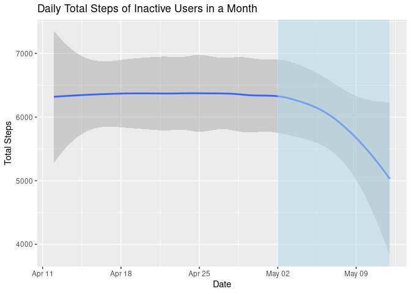
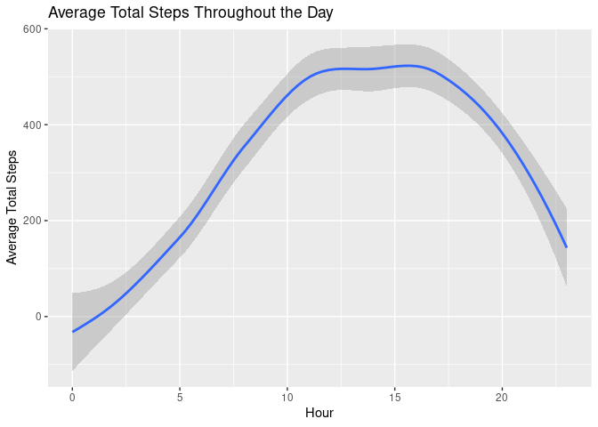
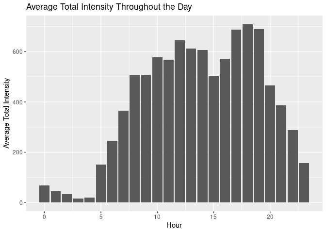

Bellabeat Case Study
================
Minh
2022-06-03

<br><br>

## 1. Background

Founded in 2013, Bellabeat is a high-tech manufacturer of health-focused
smart products for women. Bellabeat products are designed to empower
women with knowledge about their own health and habits. The company is
rapidly growing and has offices around the world. Their products are
available through online retailers as well as their own e-commerce
[website](https://bellabeat.com). Bellabeat’s cofounder and Chief
Creative Officer believes that analyzing consumer data on activity,
sleep, stress, and repoductive health could help unlock new growth
opportunities for the company.

### Bellabeat Products

-   **Bellabeat app**: An app that connects with Bellabeat smart
    products to provide users with health data.
-   **Leaf**: A smart bracelet, necklace, or clip that tracks user
    activity, sleep, and stress.
-   **Time**: A smart watch that tracks user activity, sleep, and
    stress.
-   **Spring**: A water bottle that tracks user hydration levels to
    ensure that the user is drinking enough water throughout the day.
-   **Bellabeat membership**: A subscription-based membership program
    that give users 24/7 access to personalized guidance on nutrition,
    activity, sleep, health.

Source: [Google Data Analytics Capstone: Complete a Case
Study](https://www.coursera.org/learn/google-data-analytics-capstone?specialization=google-data-analytics)

<br><br>

## 2. Business Objective

Analyze smart device usage data in order to gain insights into how
consumers use non-Bellabeat smart devices.

### Stakeholders

-   Bellabeat’s cofounder and Chief Creative Officer
-   Key members of the Bellabeat executive team
-   Bellabeat marketing analytics team

### Business Use Case:

    1. What are some trends in smart device usage?
    2. How could these trends apply to Bellabeat customers?
    3. How could these trends help influence Bellabeat marketing strategy?

<br><br>

## 3. Data Source & Preparation

FitBit Fitness Tracker Data is an open source dataset that contains
physical activity, heart rate, and sleeping habit of thirty three Fitbit
users. Fitbit is an American electronics company that produces physical
fitness monitors and activity trackers such as smartwatches, pedometers,
and sleep quality monitors. The dataset can be downloaded
[here](https://www.kaggle.com/datasets/arashnic/fitbit).

### Data Limitations

1.  A sample size of 33 is inadequate to ensure representativeness of
    the world population.
2.  Since Fitbit operates mainly in the United States and Canada in
    2016, I assume that the thirty Fitbit users are from North America.
    This means that the analysis can only offer trends in smart device
    usage of users in North America.
3.  Fitbit products are available for both men and women. Even though we
    are only interested in studying trends in smart device usage of
    women, we cannot exclude male from the data because information on
    users is not provided.
4.  The data was gathered in 2016, which is 6 years old and will not be
    current data.
5.  Only 24 out of the 33 FitBit users provided their daily sleep data
    or an error occurred during the data collection process leading to
    missing data.

### Preparing Data Using R

The R programming language will be used to prepare, process, and analyze
the data because the dataset is large and is stored in multiple csv
files.

#### Step 1: Load packages

Notes: setting up R environment by installing and loading the
‘tidyverse’, ‘janitor’, and ‘lubridate’ packages.

``` r
install.packages("tidyverse")
```

    ## Installing package into '/cloud/lib/x86_64-pc-linux-gnu-library/4.2'
    ## (as 'lib' is unspecified)

``` r
install.packages("janitor")
```

    ## Installing package into '/cloud/lib/x86_64-pc-linux-gnu-library/4.2'
    ## (as 'lib' is unspecified)

``` r
library(tidyverse)
```

    ## ── Attaching packages ─────────────────────────────────────── tidyverse 1.3.1 ──

    ## ✔ ggplot2 3.3.6     ✔ purrr   0.3.4
    ## ✔ tibble  3.1.7     ✔ dplyr   1.0.9
    ## ✔ tidyr   1.2.0     ✔ stringr 1.4.0
    ## ✔ readr   2.1.2     ✔ forcats 0.5.1

    ## ── Conflicts ────────────────────────────────────────── tidyverse_conflicts() ──
    ## ✖ dplyr::filter() masks stats::filter()
    ## ✖ dplyr::lag()    masks stats::lag()

``` r
library(janitor)
```

    ## 
    ## Attaching package: 'janitor'

    ## The following objects are masked from 'package:stats':
    ## 
    ##     chisq.test, fisher.test

``` r
library(lubridate)
```

    ## 
    ## Attaching package: 'lubridate'

    ## The following objects are masked from 'package:base':
    ## 
    ##     date, intersect, setdiff, union

#### Step 2: Import Data

Notes: importing 6 csv files after they have been uploaded to the
project directory.

``` r
daily_activity <- read.csv("FitBit Data 4.12.16-5.12.16/dailyActivity_merged.csv")

daily_sleep <- read.csv("FitBit Data 4.12.16-5.12.16/dailySleep_merged.csv")

daily_steps <- read.csv("FitBit Data 4.12.16-5.12.16/dailySteps_merged.csv")

hourly_intensities <- read.csv("FitBit Data 4.12.16-5.12.16/hourlyIntensities_merged.csv")

hourly_steps <- read.csv("FitBit Data 4.12.16-5.12.16/hourlySteps_merged.csv")
```

<br><br>

## 4. Data Cleaning

I took 3 steps to clean and prepare the data for analysis: remove
duplicates, clean column names, convert date string to date format.

### Step 1: Remove Duplicates

Notes: removing duplicates by using the *distinct()* function in the
‘dplyr’ package.

``` r
daily_activity <- distinct(daily_activity)
daily_sleep <- distinct(daily_sleep)
daily_steps <- distinct(daily_steps)
hourly_intensities <- distinct(hourly_intensities)
hourly_steps <- distinct(hourly_steps)
```

### Step 2: Clean Column Names

Notes: changing column naming convention from camel case to underscore
case by using the *clean_names()* function in the ‘janitor’ package.

``` r
daily_activity <- clean_names(daily_activity)
daily_sleep <- clean_names(daily_sleep)
daily_steps <- clean_names(daily_steps)
hourly_intensities <- clean_names(hourly_intensities)
hourly_steps <- clean_names(hourly_steps)
```

### Step 3: Convert Date Format from String to Date

Notes: converting the date from String to Date format by using the
*mdy()* and *mdy_hms()* functions in the ‘lubridate’ package. Rename
date column of each dataset to make the date field consistent across all
data frames.

``` r
daily_activity <- daily_activity %>%
  rename(date = activity_date) %>%
  mutate(date = mdy(date))

daily_sleep <- daily_sleep %>%
  rename(date = sleep_day) %>%
  mutate(date = mdy(substr(date, 1, 9)))

daily_steps <- daily_steps %>%
  rename(date = activity_day) %>%
  mutate(date = mdy(date))

hourly_intensities <- hourly_intensities %>%
  rename(date = activity_hour) %>%
  mutate(date = mdy_hms(date))

hourly_steps <- hourly_steps %>% 
  rename(date = activity_hour) %>%
  mutate(date = mdy_hms(date))
```

<br><br>

## 5. Data Analysis

Before analyzing the data, I preform a merge to join data from the daily
activity data frame with the daily sleep data frame. This will simplify
the code during the analysis process.

``` r
activity_sleep <- merge(daily_activity, daily_sleep, by = c("id", "date"), all.x = TRUE) %>%
  drop_na()
```

### Identify Healthy Users

Grouping daily activity data frame by user and performing average
calculations to determine healthy users. Moving forward, I will refer to
users with an average daily total steps greater than the recommended
10,000 steps as active users. Diving deeper into the data of inactive
users will give insights that Bellabeat can use to provide
recommendations to their users.

``` r
user_daily_activity <- daily_activity %>%
  group_by(id) %>% 
  summarize(daily_steps = mean(total_steps), daily_very_active_minute = mean(very_active_minutes), daily_sedentary_minutes = mean(sedentary_minutes), na.rm = T, .groups = "drop") %>%
    mutate(user_type = case_when(daily_steps >= 10000 ~ "active", daily_steps < 10000 ~ "inactive"))
```

### Compare Active User with Inactive User

Using the average daily active minutes, average daily steps, and average
sedentary minutes of users from the previous calculation, we can perform
a comparison between active users vs. inactive users.

#### Summary of Active Users

``` r
user_daily_activity %>%
  filter(user_type == "active") %>%
  select(daily_steps, daily_very_active_minute, daily_sedentary_minutes, user_type) %>%
  summary()
```

    ##   daily_steps    daily_very_active_minute daily_sedentary_minutes
    ##  Min.   :10814   Min.   :18.90            Min.   : 707.5         
    ##  1st Qu.:11154   1st Qu.:27.10            1st Qu.: 842.4         
    ##  Median :11371   Median :36.29            Median :1055.3         
    ##  Mean   :12488   Mean   :42.76            Mean   : 974.5         
    ##  3rd Qu.:13440   3rd Qu.:52.39            3rd Qu.:1112.7         
    ##  Max.   :16040   Max.   :85.16            Max.   :1148.0         
    ##   user_type        
    ##  Length:7          
    ##  Class :character  
    ##  Mode  :character  
    ##                    
    ##                    
    ## 

#### Summary of Inactive Users

``` r
user_daily_activity %>%
  filter(user_type == "inactive") %>%
  select(daily_steps, daily_very_active_minute, daily_sedentary_minutes, user_type) %>%
  summary()
```

    ##   daily_steps     daily_very_active_minute daily_sedentary_minutes
    ##  Min.   : 916.1   Min.   : 0.09677         Min.   : 662.3         
    ##  1st Qu.:4736.8   1st Qu.: 1.86823         1st Qu.: 757.4         
    ##  Median :6954.2   Median : 8.91371         Median :1085.6         
    ##  Mean   :6181.7   Mean   :14.26399         Mean   :1005.8         
    ##  3rd Qu.:8149.6   3rd Qu.:13.94758         3rd Qu.:1219.4         
    ##  Max.   :9794.8   Max.   :87.33333         Max.   :1317.4         
    ##   user_type        
    ##  Length:26         
    ##  Class :character  
    ##  Mode  :character  
    ##                    
    ##                    
    ## 

The summary shows that only 21% of users have an average daily total
steps greater than the recommended 10,000 steps. It also reveals that
active users spend on average 42.8 minutes doing intense activities and
take twice as many steps as inactive users. The average sedentary
minutes is the same across the two group of users.

### ggplot Daily Total Steps of Inactive Users Throughout the Month

Notes: filtering user daily activity data frame by inactive users and
merging it with daily steps to find trends in daily total steps of
inactive users in a month.

``` r
user_daily_activity %>%
  filter(user_type == "inactive") %>%
  merge(daily_steps, by = c("id"), all.x = TRUE) %>%
ggplot() +
  geom_smooth(mapping = aes(x = date, y = step_total)) +
labs(title = "Daily Total Steps of Inactive Users in a Month", x = "Date", y = "Total Steps") +
  annotate("rect", xmin = as.Date("2016-5-02"),
           xmax = as.Date("2016-05-12"), ymin = -Inf, ymax = Inf, fill = "lightblue", alpha = 0.5)
```

    ## `geom_smooth()` using method = 'loess' and formula 'y ~ x'

<!-- -->

The line graph shows the daily total steps decreasing exponentially
after 3 weeks into the data.

### ggplot Sedentary Minutes vs. Total Minutes Asleep

Notes: using the merged activity sleep data frame to determine if there
is a correlation between sedentary minutes and total minutes asleep.

``` r
ggplot(data = activity_sleep, mapping = aes(x = sedentary_minutes, y = total_minutes_asleep)) +
  geom_point(alpha=0.5) +
  geom_smooth() +
  labs(title = "Sedentary Minutes vs. Total Minutes Asleep", x = "Sedentary Minutes", y = "Total Minutes Asleep") +
  annotate("text", x = 400, y = 900, label = paste0("R = ", cor(activity_sleep$sedentary_minutes, activity_sleep$total_minutes_asleep), sep = ""))
```

    ## `geom_smooth()` using method = 'loess' and formula 'y ~ x'

<!-- -->

Since R is equal to - 0.6, there is a negative correlation between
Sedentary Minutes vs. Total Minutes Asleep. This means that being
inactive during the day could lead to less sleep at night.

### Summary Sedentary Minutes of Healthy Users

Since we know that there is a negative correlation between Sedentary
Minutes and Total Minutes Asleep, we should dive deeper into the data of
users who have an average daily sleep minutes greater than the
recommended 7 hours. Determining the average daily sedentary minutes of
these users will give insights that Bellabeat can use to provide
recommendations to their users.

``` r
activity_sleep %>%
  group_by(id) %>% 
  summarize(daily_minutes_asleep = mean(total_minutes_asleep), daily_sedentary_minutes = mean(sedentary_minutes), na.rm = T, .groups = "drop") %>%
  filter(daily_minutes_asleep >= 420) %>%
  select(daily_minutes_asleep, daily_sedentary_minutes) %>%
    summary()
```

    ##  daily_minutes_asleep daily_sedentary_minutes
    ##  Min.   :432.0        Min.   :443.3          
    ##  1st Qu.:446.0        1st Qu.:635.5          
    ##  Median :453.1        Median :662.3          
    ##  Mean   :476.2        Mean   :649.6          
    ##  3rd Qu.:477.7        3rd Qu.:692.2          
    ##  Max.   :652.0        Max.   :807.8

The average daily sedentary minutes of healthy users is 888 minutes.
Bellabeat can use this measurement as a threshold to suggest users to be
more active throughout the day.

### ggplot Average Total Steps Throughout the Day

Notes: grouping users by id and hour to find trends in users activity
throughout the day.

``` r
hourly_steps %>%
  mutate(hour = hour(date)) %>%
  group_by(id, hour) %>%
  summarize(average_steps = mean(step_total)) %>%
  ggplot() +
  geom_smooth(mapping = aes(x = hour, y =average_steps)) +
  labs(title = "Average Total Steps Throughout the Day", x = "Hour", y = "Average Total Steps")
```

    ## `summarise()` has grouped output by 'id'. You can override using the `.groups`
    ## argument.
    ## `geom_smooth()` using method = 'loess' and formula 'y ~ x'

<!-- -->

The line graph shows that users are most active between 10 am and 7 pm.
These information can help the company decide when to send
advertisements and notifications to their user base.

### ggplot Average Total Intensity Throughout the Day

Notes: grouping users by id and hour to find trends in users activity
throughout the day.

``` r
hourly_intensities %>%
  mutate(hour = hour(date)) %>%
  group_by(id, hour) %>%
  summarize(average_intensity = mean(total_intensity)) %>%
  ggplot() +
  geom_col(mapping = aes(x = hour, y =average_intensity)) +
  labs(title = "Average Total Intensity Throughout the Day", x = "Hour", y = "Average Total Intensity")
```

    ## `summarise()` has grouped output by 'id'. You can override using the `.groups`
    ## argument.

<!-- -->

The bar graph shows that users typically do intense activity from 5 pm
to 7 pm. This could indicate that a reasonable number of users are busy
at this time.

<br><br>

## 6. Insights and Recommendation

The following is a list of insights and recommendation that I have
obtained from analyzing the FitBit Fitness Tracker Data.

-   Seventy nine percent of users are not getting enough steps per day.
    Bellabeat app should encourage users who have not reached the
    recommended 10,000 steps to be more active by sending a notification
    at approximately 5 pm to 7 pm (the time when users are usually most
    active).

-   Active users spent on average 42.8 minutes doing intense activities
    and take twice as many steps as inactive users. At 5 pm every day,
    Bellabeat app should alert users who have taken less than 5000 steps
    to spent roughly 42.8 minutes doing intense exercises.

-   Users overall activity starts decreasing rapidly after 3 weeks into
    the data. Bellabeat should encourage users to continue wearing their
    smart devices throughout the day by reminding users of the health
    benefits of Bellabeat products.

-   There is a negative correlation between sedentary minutes and total
    minutes asleep. Bellabeat should encourage their users to spend less
    time doing sedentary activity because it could lead to better sleep.

-   Healthy users spend an average of 14 hours and 44 minutes doing
    sedentary activities. Bellabeat app should encourage users to be
    more active once they have reached the recommended daily sedentary
    minutes.

-   Users are most active between 10 am and 7 pm. Bellabeat should send
    advertisements and notifications to their users at around this time
    frame.
